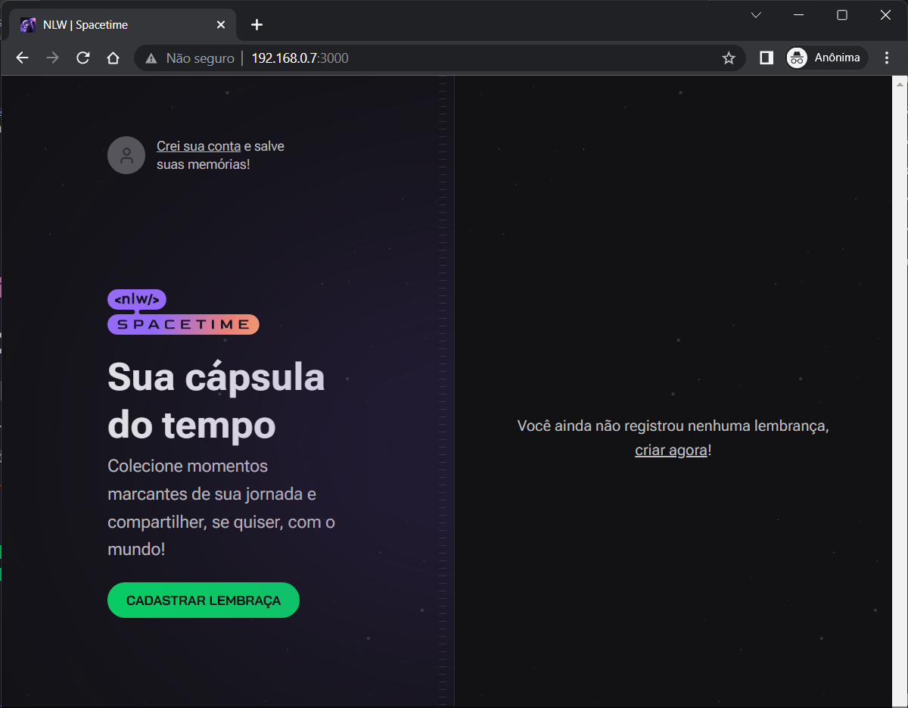
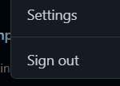
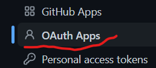
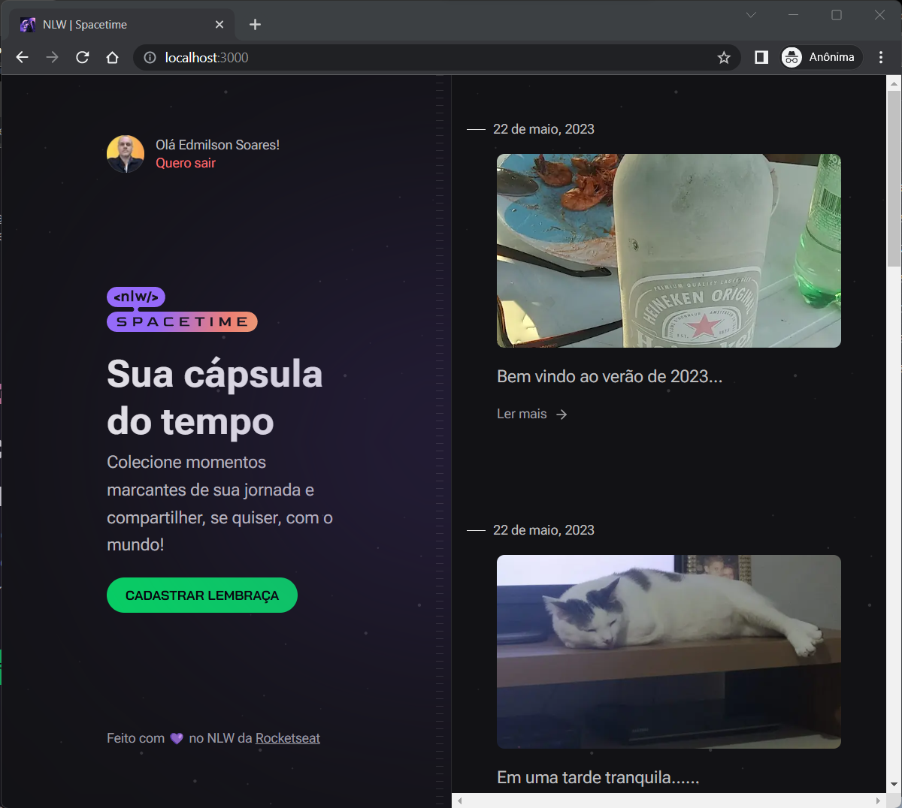
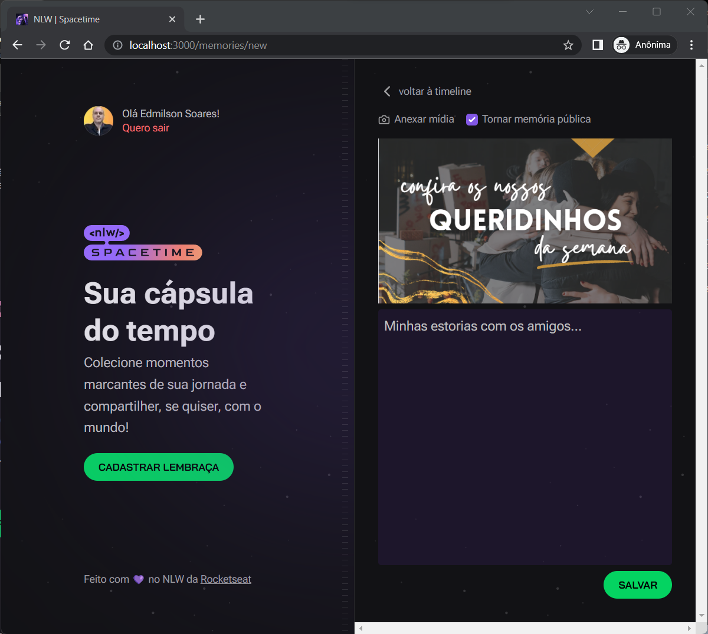

# Space Time
## Rede Social para Devs

Este aplicativo tem como objetivo permitir o registro de um acontecimento através de um post informando uma imagen/vídeo e um texto descrevendo o fato.

Nela foi criado tando o back-end como front-end e mobile, permitindo o experimento de tecnologias das três áreas de atuação. Para isto é feito a autenticação no Github e mediante autorização se obtem um código que é enviado para o backent autenticar e retornar um token que manterá a sessão ativa e pertitirá que o usuário interaja com a aplicação.

Aqui, iremos detalhar as funcionalidades e recursos utilizados no front-end.



------

<a name="ancora"></a>
- [Techs](#techs)
- [Instaçção e Execução](#install)
- [Funcionalidades](#feature)


<a id="techs"></a>
## Techs
- React
- Next
- Typescript
- Tailwind
- Axios
- Dayjs
- js-cookie
- jwt-decode
- Eslint

<a id="install"></a>
## Como Instalar e Rodar a Aplicação
1. Criar no github uma aplicação [Veja](#registroGithub)
```
    CLIENT_ID
```
2. Clonar o projeto: 
```
    git clone https://github.com/esbnet/nlw-spacetime-web.git
```
3. Entrar na pasta do projeto:  
```
    cd nlw-spacetime-web
```
4. Instalar dependências: 
```
    npm install
```
5. Rodar o aplicativo: 
```
    npm run dev
```
6. Criar na pasta raiz o arquivo 
```
    .env.local
```
7. Criar a variável: 
```
    NEXT_PUBLIC_GITHUB_CLIENT_ID=código_client_id_gerado_no_git
```
8. Criar a variável contendo endereço e porta do servidor (back-end/api)
```
    NEXT_PUBLIC_SERVER_URL=http://0.0.0.0:3333
```

<a id="registroGithub"></a>
## Registrar nova aplicação OAuth no Github 

Atalho:
[https://github.com/settings/applications/new](https://github.com/settings/applications/new)

| Passos      |tela        |
| ----------- |:-------------:|
| 1. Clique em settins||
| 2. Clique em Developer settings||
| 3. Clique em OAuth||
| 4. Clique em New OAuth App||


<a id="feature"></a>
## Funcionalidades

- [x] Login / Registro
- [x] Logout
- [x] Inclusão de memória
- [ ] Edição de memória
- [ ] Deleção de memória
- [ ] Filtro de data

<a id="Registrar"></a>
beidsflasdçf asdf sdlf 


## Criar conta


Ao logar no aplicativo você obtêm sua lista de memórias registradas

## Registrar uma memória

Clique em adicionar mídia, ecolha uma imagem que represente o momento, informe se irá ficar pública ou não, descreva o momento com os detalhes que achar necessário e clique em salvar. Pronto!😎 Sua memória foi registrada e poderá recordá-la sempre que sentir vontade.



