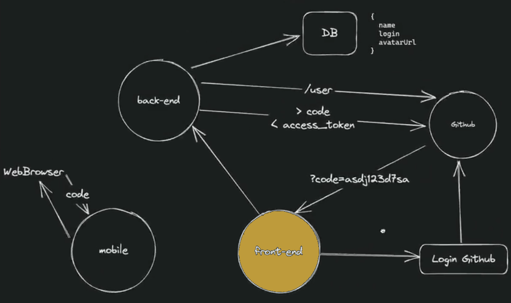
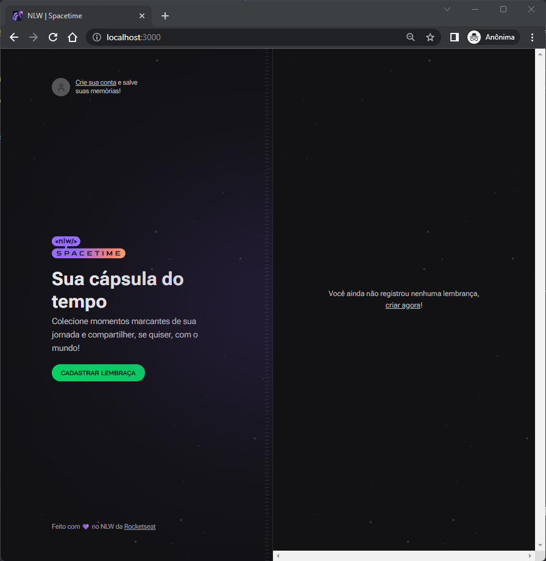
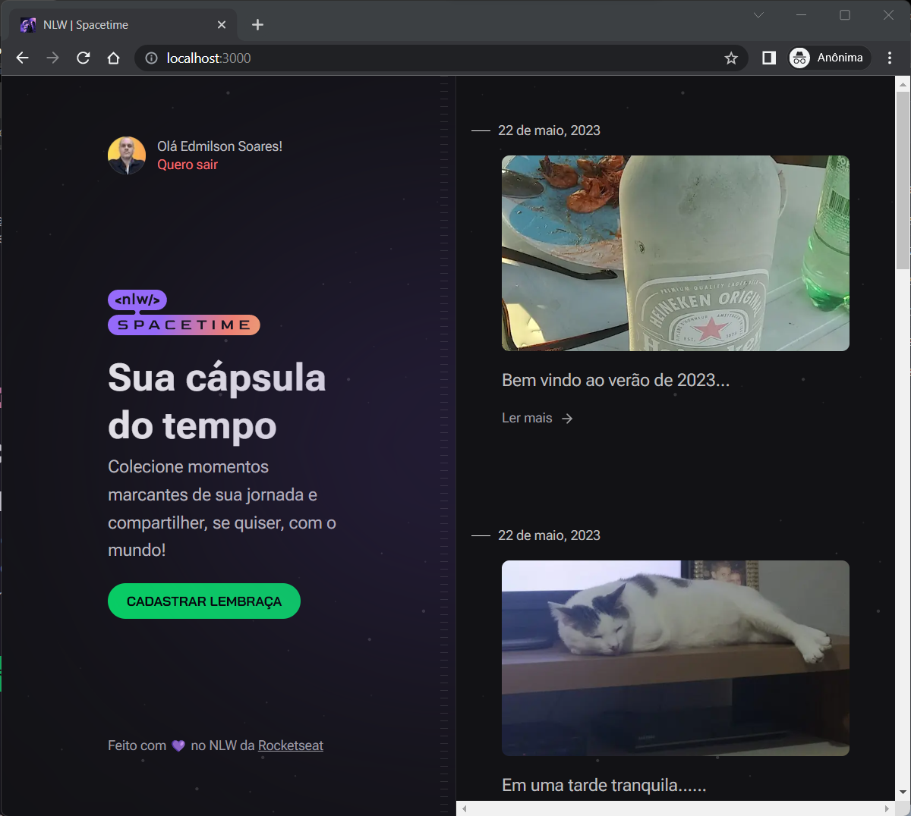
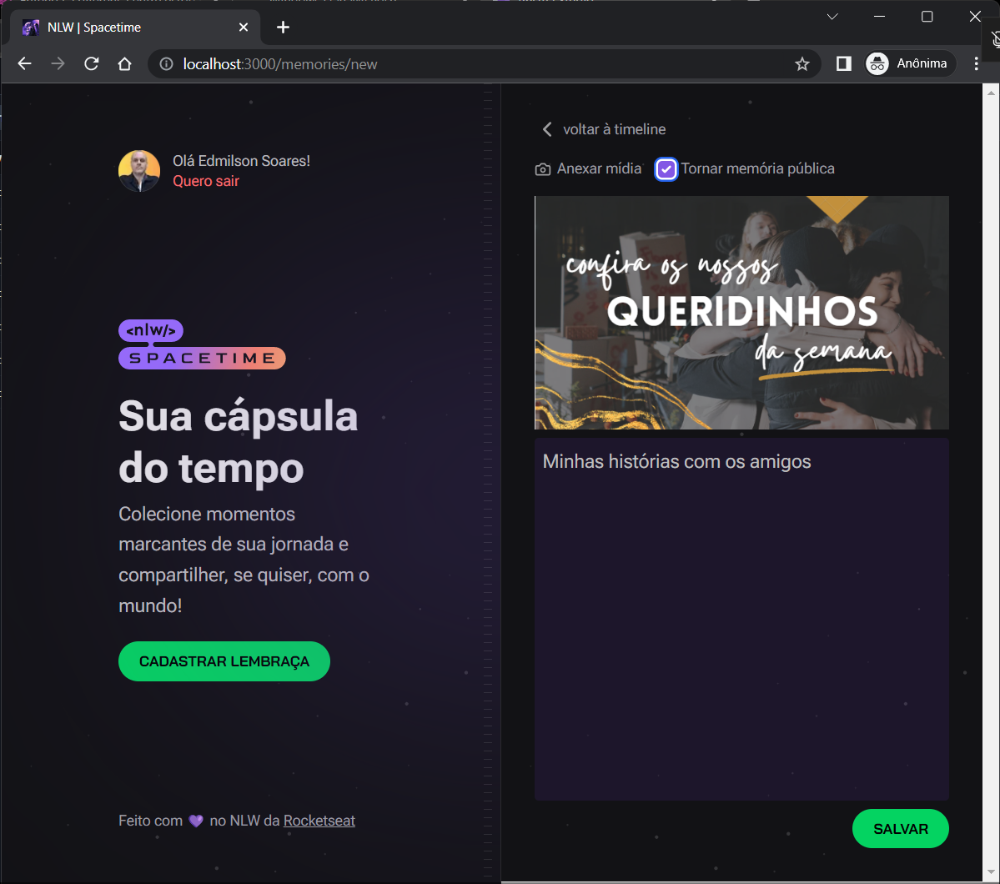
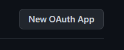

# Font-end / [Back-end](https://github.com/esbnet/nlw-spacetime-server) / [Mobile](https://github.com/esbnet/nlw-spacetime-app)

<div align="center">


</div>

## Rede Social para Devs

Este aplicativo tem como objetivo permitir o registro de um acontecimento através de um post informando uma imagen/vídeo e um texto descrevendo o fato.

Nela foi criado tando o back-end como front-end e mobile, permitindo o experimento de tecnologias das três áreas de atuação. Para isto é feito a autenticação no Github e mediante autorização se obtem um código que é enviado para o backent autenticar e retornar um token que manterá a sessão ativa e pertitirá que o usuário interaja com a aplicação.

Aqui, iremos detalhar as funcionalidades e recursos utilizados no front-end.

<a id="menu"></a>

- [Techs](#techs)
- [Pré-requisitos](#requisitos)
- [Arquitetura](#arch)
- [Instação e Execução](#install)
- [Funcionalidades](#feature):
  - [Login](#registrar)
  - [Relação de memórias](#listagem)
  - [Inclusão de memória](#new)
  - [Logout](#logout)

<p style="text-align:right"><a href="#menu">menu</a> &uarr;</p>

<a id="techs"></a>

## Techs

- React
- Next
- Typescript
- Axios
- Tailwind
- Dayjs
- js-cookie
- jwt-decode
- Eslint

<p style="text-align:right"><a href="#menu">menu</a> &uarr;</p>

<a id="requisitos"></a>

## Pré-requisitos

- Node versão >= 16.16.0
- Npm versão >= 5.2.0 (já trás o npx)
- Conta no github
- Back-end em execução

<p style="text-align:right"><a href="#menu">menu</a> &uarr;</p>

<a id="arch"></a>

## Arquitetura do projeto / Autenticação OAuth (Github)

A seguir descrevemos as etapas para a autenticação dos clientes (web/mobile) no Github.


1. No cliente (web/mobile), ao clicar em "Criar sua conta", a aplicação aciona o Github com o "GITHUB_CLIENT_ID" préviamente registrado;
2. Após auntenticação no github, ele fornece um código que é enviado para o end-point `/register`;
3. Aqui no back-end, o código recebido do cliente é enviado para o github juntamente como `client_id` e `client_secret` que estão nas variáveis de ambiente;
4. O github devolve um `access_token` e com ele nós fazemos uma chamada na api do git (`https://api.github.com/user`) para pegar os dados do usuário;
5. Neste momento, é verificado no bando de dados do server se este usuário já é cadastrado. Caso não seja, o server registra no banco e em seguida retorna um `access_token` para a chamada do cliente (web/mobile) confirmando a autenticação.

Após este processo, de posse do `access_token`, os clientes poderão realizar chamadas a api do back-end.

<p style="text-align:right"><a href="#menu">menu</a> &uarr;</p>

<a id="install"></a>

## Instalando e Rodar a Aplicação

1. Criar no github uma aplicação [Veja como](#registroGithub)

```
    CLIENT_ID
```

2. Clonar o projeto:

```
    git clone https://github.com/esbnet/nlw-spacetime-web.git
```

3. Entrar na pasta do projeto:

```
    cd nlw-spacetime-web
```

4. Instalar dependências:

```
    npm install
```

5. Rodar o aplicativo:

```
    npm run dev
```

6. Criar na pasta raiz o arquivo

```
    .env.local
```

7. Criar a variável:

```
    NEXT_PUBLIC_GITHUB_CLIENT_ID=código_client_id_gerado_no_git
```

8. Criar a variável contendo endereço e porta do servidor (back-end/api)

```
    NEXT_PUBLIC_SERVER_URL=http://0.0.0.0:3333
```

<p style="text-align:right"><a href="#menu">menu</a> &uarr;</p>

<a id="feature"></a>

## Funcionalidades

- [x] Login / Registro
- [x] Logout
- [x] Inclusão de memória
- [ ] Edição de memória
- [ ] Deleção de memória
- [ ] Filtro de data

<p style="text-align:right"><a href="#menu">menu</a> &uarr;</p>

<a id="registrar"></a>

## Login / Registro

Na tela de entrada do sistema o usuário possui três formas de realizar o registro/login no sistema. Pode clicar no link do perfil "Crie sua conta", no botão "Cadastrar Lembrança" ou no link "criar agora" na timeline. Em qualquer das opições será realizado o mesmo processo. O usuário será logado no Github e levado para a relação de memórias.

<div align="center">



</div>

<p style="text-align:right"><a href="#menu">menu</a> &uarr;</p>

<a id="listagem"></a>

## Login / Registro

Ao logar no aplicativo você obtêm sua lista de memórias registradas e está pronto para matar a saudade ou registrar novas memórias.


<div align="center">



</div>

<p style="text-align:right"><a href="#menu">menu</a> &uarr;</p>

<a id="new"></a>

## Inclusão de memória

Clique em adicionar mídia, ecolha uma imagem que represente o momento, informe se irá ficar pública ou não, descreva o momento com os detalhes que achar necessário e clique em salvar. Pronto!😎 Sua memória foi registrada e poderá recordá-la sempre que sentir vontade.

<div align="center">



</div>

<p style="text-align:right"><a href="#menu">menu</a> &uarr;</p>

<a id="logout"></a>

## Logout

Para realizar o logout basta clicar no link do perfil "Quero sair". O sistema exclue o token de acesso, fazendo com que o usuário retorne a tela de login e impedindo o acesso a qualquer outra rota.

<p style="text-align:right"><a href="#menu">menu</a> &uarr;</p>

<a id="registroGithub"></a>
## Registrar nova aplicação OAuth no Github

Abaixo você encontra o passo-a-passo para criar as credencias para que sua aplicação possa realizar a autenticação via Github.

Atalho:
[https://github.com/settings/applications/new](https://github.com/settings/applications/new)

| Passos                                                                                                                                                                    |                             tela                             |
| ------------------------------------------------------------------------------------------------------------------------------------------------------------------------- | :----------------------------------------------------------: |
| 1. Clique em settins                                                                                                                                                      |          |
| 2. Clique em Developer settings                                                                                                                                           |      |
| 3. Clique em OAuth                                                                                                                                                        |            |
| 4. Clique em New OAuth App                                                                                                                                                |          |
| 5. Preencha os campos com os dados abaiso: <br>spacetime-web<br>http://localhost:3000<br>(opcional)<br>http://localhost:3000/ (para onde será redirecionado após o login) |  |

---

<div align="center">

Este projeto foi construido durante um dos bootcamps promovido gratuitamente pela [rockeseat 🚀](https://rocketseat.com.br) que vem ajudando a carreira de milhares de devs em todo o Brasil. Parabéns aos envolvido!!
<br>


</div>
